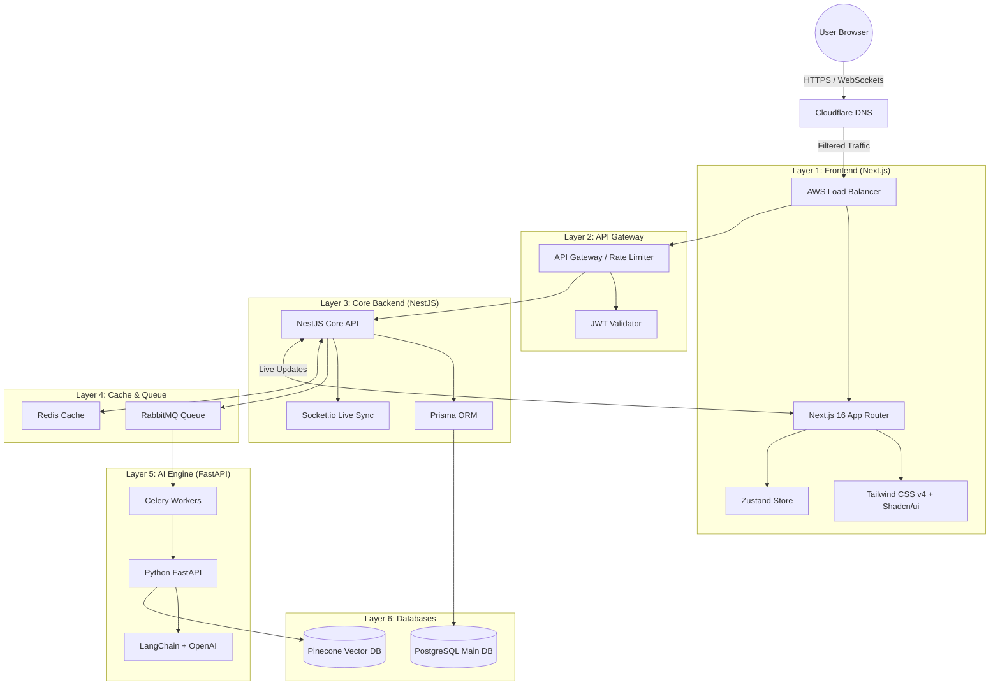

# Master System Infrastructure Diagram

This is the offline architecture blueprint for the AI-Powered Project Management Platform.

```mermaid
graph TD
    User((User Browser)) -->|HTTPS / WebSockets| DNS[Cloudflare DNS]
    DNS -->|Filtered Traffic| LB[AWS Load Balancer]

    subgraph Layer_1_Client ["Layer 1: Frontend (Next.js)"]
        LB --> FE[Next.js 16 App Router]
        FE --> F1[Tailwind CSS v4 + Shadcn/ui]
        FE --> F2[Zustand Store]
    end

    subgraph Layer_2_Gateway ["Layer 2: API Gateway"]
        LB --> GW[API Gateway / Rate Limiter]
        GW --> G1[JWT Validator]
    end

    subgraph Layer_3_Backend ["Layer 3: Core Backend (NestJS)"]
        GW --> BAPI[NestJS Core API]
        BAPI --> B1[Prisma ORM]
        BAPI --> B2[Socket.io Live Sync]
    end

    subgraph Layer_4_Queue ["Layer 4: Cache & Queue"]
        BAPI --> Broker[RabbitMQ Queue]
        BAPI <--> Redis[Redis Cache]
    end

    subgraph Layer_5_AI ["Layer 5: AI Engine (FastAPI)"]
        Broker --> Workers[Celery Workers]
        Workers --> AIAPI[Python FastAPI]
        AIAPI --> A1[LangChain + OpenAI]
    end

    subgraph Layer_6_Storage ["Layer 6: Databases"]
        B1 --> PDB[(PostgreSQL Main DB)]
        AIAPI --> VDB[(Pinecone Vector DB)]
    end

    BAPI <-->|Live Updates| FE
```
